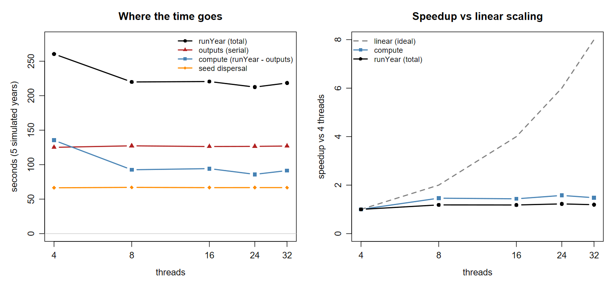
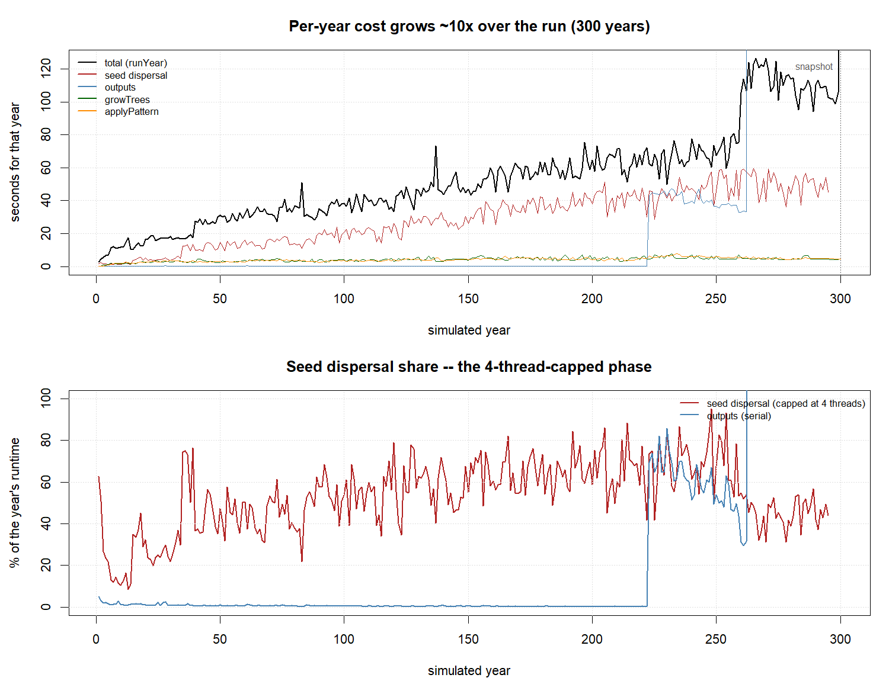
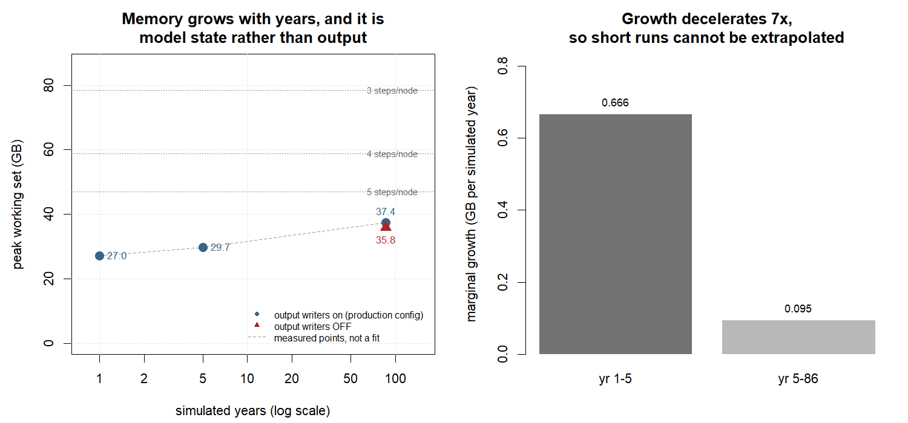

# iLand thread scaling: where the time actually goes

**2026-08-24 · landscape_alaska_01 · Threadripper 7970X (32 physical / 64 logical cores, 255.5 GB)**

## Summary

Threads buy almost nothing beyond 8, and switching the output writers off shows this is not an
artefact of output cost: **compute alone does not scale past 8 threads either.** Going from 8 to
32 threads changes total scenario runtime by ~1%.

In order of how much they matter for the Derecho round:

1. **Production ran oversubscribed -- now set explicitly, for a modest gain.** The XML carries
   `-1`, so each step took every logical processor (256 on a Derecho node) and three steps meant
   768 threads over 128 cores. Both runners now pass
   `system.settings.threadCount=${ILAND_THREADS}`, default **16**. A *single* instance shows no
   penalty from oversubscription (421 s at 256 threads vs 433 s at 8), but **three concurrent
   instances run 6.0% faster at 16 threads than at 256** — separate processes really do compete,
   where one process's oversized pool just idles. Expect less than 6% on Derecho, which is 3x
   oversubscribed against 12x in this test.
2. **A node is memory-bound, not CPU-bound**, and memory does *not* depend on thread count
   (29.71 vs 29.66 GB at 8 vs 32 threads). Steps-per-node is a memory question only.
3. **4 steps per node is supported, 5 is not.** A production-length replicate peaks at 37.4 GB,
   so 4 steps is 149 GB locally and 165–210 GB once Derecho's observed overhead is applied,
   against a 235 GB budget. Do this only after (1), since packing a node harder while every step
   requests all its cores makes contention worse.
4. **8 threads per step is enough** — scenario configuration *and* spinup. The writers-off sweep
   was expected to favour more threads and did not.
5. **Per-year cost is not constant** -- it grows ~10x over a 300-year spinup (10.9 -> 106.5
   s/yr), and the growth is concentrated in seed dispersal, the phase threads cannot help. This
   is why `filt_cond` matters more than any thread setting.
6. **Memory grows with simulated years** (27.0 GB at 1 year -> 37.4 GB at 86) and it is model
   state, not output buffers. So a short run cannot be used to size steps-per-node -- the
   headline consequence being that a 5-year concurrency test would have waved 4 steps through on
   false evidence.
7. **GeoTIFF grid inputs are correct** and can replace the `.txt` grids, but no speed benefit is
   demonstrable: model creation is dominated by the snapshot load (~85 s) and the climate
   database, next to which the grids are a rounding error.

The one thing that does not transfer from a short run is memory: it grows with simulated years,
so a 5-year test would have cleared 4 steps far too easily. Timing proportions do transfer, and
were confirmed against a full 86-year run.

## Method

Four sweeps against the same sandbox, all seeded (`randomSeed=42`) and all 5 simulated years from
a snapshot start (68 M trees), so every config does the same work:

| mode | configs | question |
|---|---|---|
| `threads` | 4, 8, 16, 24, 32 threads | how does the real scenario configuration scale? |
| `nooutput` | 4, 8, 16, 24, 32 threads, all big writers off | does *compute* scale, with output removed? |
| `geotiff` | `.txt` vs `.tif` grids | are GeoTIFF inputs equivalent, and faster? |
| `memthreads` | 8 vs 32 threads, peak RSS | does thread count change memory? |
| `memthreads` at `YEARS=1` / `86` | 8 threads | does memory grow with simulated years? |

The base config is `landscape_alaska_01_2015-2100scenario.xml` with `stand`, `saplingdetail`,
`carbon` and `water` writing every year — the real scenario configuration, not a proxy, so the
proportions transfer to the 288-line round directly.

Timings are iLand's own timer block rather than process wall time, because the block separates
output from compute. Output went to a local SSD (D:), so the output timer measures writing and
not network latency. Threads were capped at 32, the physical core count; above that is SMT,
which a Derecho node does not have.

## Results: the scenario sweep

```
 threads runYear outputs compute seed_disp sp_total sp_compute ideal
       4   260.5   125.1   135.3      66.5     1.00       1.00     1
       8   219.9   127.3    92.6      67.1     1.18       1.46     2
      16   220.5   126.3    94.3      66.7     1.18       1.44     4
      24   212.5   126.5    86.0      66.8     1.23       1.57     6
      32   218.4   127.0    91.4      66.8     1.19       1.48     8
```



### What the columns mean

Every figure is **cumulative over the whole 5-year run**, not per year — which is why `runYear`
is 260 s for a 5-year simulation rather than 260 s per year. They come from iLand's own timer
block, printed once at the end of a run, and are read by `parse_timers.R`:

| column | iLand timer | meaning |
|---|---|---|
| `runYear` | `ModelController:runYear` | total time in the simulation loop, all 5 years. The denominator for everything else. |
| `outputs` | `outputs` | total time writing output, all years. Includes `OutputManager::execute()` and any JavaScript. |
| `compute` | *derived* | `runYear − outputs`. Not an iLand timer — my subtraction, on the assumption output and compute do not overlap. The `nooutput` sweep exists to test exactly that assumption, and confirmed it. |
| `seed_disp` | `seed dispersal` | total time in seed dispersal, all years. Reported because it turned out to be the phase that caps scaling. |
| `sp_total` | *derived* | speedup of `runYear` relative to the 4-thread run: `runYear(4) / runYear(n)`. |
| `sp_compute` | *derived* | same for `compute`. Higher than `sp_total` because it excludes the serial output cost. |
| `ideal` | *derived* | what linear scaling would give: `threads / 4`. The reference the others fail to reach. |

So the two columns to read against each other are `sp_compute` (what actually happened, 1.46–1.57)
and `ideal` (what perfect scaling would give, 2–8).

**8 threads captures all of the available gain.** The 212–220 s spread across 8/16/24/32 is ~4%,
and per-thread RNG gives each config a 0.03% different workload, so 24 threads being nominally
fastest is noise rather than a result.

## Why it does not scale

Two components are flat across 4→32 threads, but for *different* reasons, and the difference
matters:

| component | mean | spread | parallelised over | max useful threads |
|---|---|---|---|---|
| `outputs` | 126.4 s | 1.7% | nothing — one SQLite connection | **1** |
| `seed dispersal` | 66.7 s | 0.9% | **species** | **4** |
| `applyPattern` / `readPattern` / `growTrees` | — | scales ~1.5× | resource units | many |

From `src/core/model.cpp` in the iLand source, seed dispersal runs
`foreach (SpeciesSet *set, mSpeciesSets) set->regeneration()` — a loop over *species*, not over
resource units. This landscape has four species (Pima, Pigl, Potr, Bene), so seed dispersal
saturates at four threads and sits at 66.7 s from 4 threads onward. The pattern and growth
phases use `threadRunner.run(...)` over resource units and do scale, but only ~1.5× on 8× the
cores.

So `outputs` is genuinely serial; **seed dispersal is not serial, it is 4-way capped.** That
distinction explains why Derecho showed ~38.8 average active cores rather than the ~17 a
strictly-serial model would predict.

Together the two account for 194 s of the 220 s at 8 threads. With ~12% of the work scalable,
Amdahl caps total speedup at ~1.14× however many cores are added — which is what the plot shows
against the dashed ideal.

The RU-parallel phases scale sub-linearly because of memory bandwidth, not logic: the 2 m light
grid is 17,700² ≈ **313 million cells**, streamed every simulated year. More threads do not widen
the memory bus.

### The 98% CPU observation, resolved

Three concurrent local instances pegged the CPU at 98%, which looks like it contradicts
"8 threads is enough". It does not. Those runs used `threadCount = -1`, so each instance
requested *all 64 logical cores* — 192 threads on 64 cores, 3× oversubscribed. The CPU was
saturated by threads contending for cores, not by work that needed them.

High CPU utilisation is not evidence of useful parallelism. Nothing has been missed here; this is
iLand's architecture meeting a four-species landscape.

## Results: writers off

The scenario sweep derives compute as `runYear − outputs`, which assumes output and compute do
not overlap. Disabling the writers removes the assumption:

```
 threads compute_s speedup   note
       4    109.4    1.00
       8     92.7    1.18    best
      16    110.7    0.99    no better than 4 threads
      24    110.0    0.99
      32    104.9    1.04
```

`outputs` fell from 126.4 s to **0.6 s**, confirming the writers were genuinely off and that
writing really is ~126 s — 57% of the 220 s scenario run.

**Compute does not scale past 8 threads even with output removed.** This is the sharper version
of the headline result, and it is the outcome the spinup case was hoping against: a spinup writes
on only 41 of 300 years, so most of its years look like these runs. They still want 8 threads,
not 40.

One incidental result: at 4 threads compute was 135.3 s with writers on but 109.4 s with them
off — 26 s of interference, because the writer competes for one of only four threads. At 8+
threads the difference vanishes (92.6 vs 92.7 s). So the writer needs one spare thread, and gets
it from 8 onward.

## Results: GeoTIFF inputs

**Correct.** `stand` row counts agree to **0.002%** between `.txt` and `.tif` (1,367,999 vs
1,367,973) — tighter than the 0.031% spread the threads sweep produces from per-thread RNG alone.
The `.tif` grids are equivalent inputs and are safe to adopt.

**No demonstrable speed benefit.** Model creation was 175 s for `.txt` and 146 s for `.tif`,
which looks like a 17% win, but it is not attributable to format. Creation time in run order:

```
t4  t8  t16 t24 t32 fmt_txt fmt_tif n4  n8  n16 n24 n32
188 179 178 174 175   175     146   153 149 150 151 150
|<------------ .txt ----------->|  tif |<---- .txt ---->|
```

The five `nooutput` runs read the **same `.txt` grids** and matched `fmt_tif` at ~150 s. Creation
time drifts downward across the session (188 → ~150, a 25% spread) regardless of format —
consistent with OS page cache warming on the 10 GB snapshot. The format difference, if any, is
smaller than that drift.

Input volume is 80.2 MB of ASCII against 19.6 MB of GeoTIFF, read once per run.

**Decomposing model creation shows why the format cannot matter much.** Splitting three runs at
their logged phase boundaries:

| | grids | climate setup | after climate | `loadSnapshot` | total creation |
|---|---|---|---|---|---|
| `fmt_txt` | .txt | 36.6 s | 138.9 s | 85.4 s | 175.5 s |
| `fmt_tif` | .tif | **23.6 s** | 123.0 s | 84.2 s | 146.7 s |
| `n8` | .txt | 35.9 s | **113.3 s** | 84.8 s | 149.2 s |

Two things kill the format explanation:

- **13 s of the 29 s "GeoTIFF win" is in the climate setup phase** — loading 736 climate tables
  from SQLite, which grid format cannot possibly affect.
- In the phase where the grids *are* read, the `.txt` run `n8` was **faster** than the `.tif` run
  (113.3 s vs 123.0 s).

And `loadSnapshot` is 84–85 s in all three, identical to within 1.4% — **the single biggest
component of model creation, ~57% of it, and completely independent of grid format.** Grid
reading never even earns its own timer; it is below the noise floor of a phase dominated by
pulling 68 M trees out of a 10 GB snapshot and 736 climate tables out of SQLite.

So your instinct about extent is right in direction but the specific reason is sharper: it is not
that 80 MB is too small to matter in absolute terms, it is that model creation is dominated by
the snapshot and the climate database, and the grids are a rounding error next to both. A
landscape large enough for grid format to matter would have to have grids comparable in size to
its snapshot.

The reason to switch is disk footprint and tidiness, not speed.

## Production log: the sandbox conclusions, confirmed on Derecho

A real 300-year spinup log from Derecho (`derecho_temp_log.txt`, 103 MB) settles two things the
sandbox could only infer. Total run: **4 h 44 m 52 s**.

**1. `threadCount = -1` resolves to 256 threads.** The log opens with
`Multithreading enabled: true thread count: 256` — Derecho's 128 physical cores with SMT. So
each step requests 256 threads, and three steps on a node is **768 threads competing for 128
cores**, 6× oversubscribed. `launch_cf --nthreads 40` does not constrain iLand's thread count;
it never reaches the model.

**2. Seed dispersal really is species-capped, and it dominates.** Two timers bracket it:

| timer | value | what it is |
|---|---|---|
| `seed dispersal` | 7 h 43 m | summed across the parallel workers |
| `seed dispersal (all species)` | 2 h 22 m 42 s | wall-clock for the same work |

The ratio is **3.24× effective parallelism** — against 4 species in this landscape. That is the
species-parallel cap from `model.cpp` measured directly in production, at 81% efficiency across
four workers. No thread count raises it, because there is no fifth species to give a fifth
thread.

Where the 300 years actually went:

| phase | share | scales with threads? |
|---|---|---|
| **seed dispersal** | **50.1%** | no — capped at 4 (species) |
| establishment | 12.0% | partly |
| `outputs` | 16.2% | no — serial |
| `water:run` | 7.9% | yes (RU-parallel) |
| `growTrees()` | 7.3% | yes (RU-parallel) |
| `applyPattern()` | 7.3% | yes (RU-parallel) |

**Half the run is a four-thread phase, and the genuinely thread-scalable phases are about 15% of
it.** That is the whole answer to "why doesn't it scale", and it is much starker in the spinup
than in the sandbox scenario runs, where output writing was the bigger share.

## Per-year cost model

The useful way to use all of this. At 8 threads, per simulated year:

| | cost |
|---|---|
| compute (measured, writers off) | ~18.5 s |
| output written | ~25.5 s on top |

So a **year that writes output costs ~2.4× a year that does not**, and no thread count improves
the ratio. Cross-checked against the real 300-year spinup (64 threads, writing to the network
drive): compute 13.3 s/yr, output 37.3 s per output-year — same shape, the higher output figure
explained by the network destination.

- **A long run that writes rarely is cheap.** The 300-year spinup writes on 41 years; the other
  259 run at compute cost only. This is why `filt_cond = 260` matters far more than any thread
  setting.
- **A short run that writes every year is dominated by writing.** 100 output-years is ~42 min of
  serial writing before any compute, untouchable by cores.

### Per-year cost is not constant — it grows ~10× over a spinup



From the production log, per simulated year:

| | s/yr |
|---|---|
| mean of years 1–20 | 10.9 |
| mean of the last 20 (excluding the snapshot year) | 106.5 |
| **growth factor** | **9.8×** |
| the snapshot year (300) | 1178 |

So it is **not** linear in simulated years — a 300-year spinup is far more expensive at the end
than the start, and the growth is in *seed dispersal* (the red line tracking the black total),
which is what the bottom panel shows: seed dispersal rises from ~20% of a year early on to
40–88% later.

**One correction to an earlier version of this report.** It said per-year compute "grows with
standing tree count". I did not measure tree count — that is an inference about the mechanism,
and a plausible one (more trees and more seed sources make dispersal and establishment more
expensive), but the only thing measured here is the *timers*. Treat the tree-count explanation
as a hypothesis, not a result.

Output is a step change rather than a gradient: **41 of the 300 years write output, the first at
year 223.** Before that the `outputs` timer is flat zero; after it, ~40 s/yr, plus the 18 m 6 s
snapshot at year 300. That is the `filt_cond` doing its job, and it is why the spinup is cheap
despite being 300 years long.

### On the "write queue clogging up" hypothesis

Worth addressing directly, because it is a reasonable worry and the answer is clean: **it cannot
happen, because iLand's writes are synchronous inside the year loop.** The `outputs` timer sits
*within* `ModelController:runYear`, so the model stops and waits for each year's writing to
finish before starting the next year. There is no queue to fall behind, and the simulation can
never be "at year 300 while the disk is still on year 280".

The `nooutput` sweep is the direct evidence: switching the writers off dropped `outputs` from
126.4 s to 0.6 s and dropped total `runYear` by almost exactly the same amount (220 s → 93 s).
If writing were asynchronous, removing it would not have shortened the year loop like that.

The cost is real, it is just paid immediately rather than accumulating — which is worse for
wall-clock but much easier to reason about. Turning on more tables (`tree`, `sapling`, `water`,
`carbon`) makes each output-year proportionally slower, and no thread count helps, because
`outputs` is a single SQLite connection.

**The model was checked against a full production-length run** (86 years, 8 threads), which is
the strongest validation available here:

| | from the 5-year sweep | measured over 86 years |
|---|---|---|
| compute | 18.5 s/yr | 22.0 s/yr |
| output | 25.5 s/yr | 23.5 s/yr |
| total | 44.0 s/yr | 45.6 s/yr |

Within 4% on the total, with compute drifting up and output down exactly as the growing tree
population predicts. So the per-year proportions do transfer from short runs — it is only
*memory* that does not. The whole 86-year replicate took 1 h 08 m locally at 8 threads, against
~5 h on Derecho: slower cores, a shared node, and output going to the network rather than a
local SSD.

## What actually limits a node: memory

From the completed Derecho jobs, `resources_used.mem` for 3-step jobs ran **124.05–157.64 GB**,
i.e. **41.4–52.5 GB per step**. Against 235 GB usable:

| steps/node | expected total | headroom |
|---|---|---|
| 3 | 124–158 GB | comfortable |
| 4 | 166–210 GB | 25 GB at the observed maximum — 11% |
| 5 | 207–263 GB | over budget at the maximum |

Four steps is plausible but **11% headroom against a 27% spread across observed jobs is not a
safe margin**, so staying at 3 was the right call on that evidence alone. Note also that PBS
`resources_used.mem` is a polled high-water mark, so a peak shorter than the polling interval can
be missed — the true maximum is at least these figures.

### Does thread count change the footprint? No.

One instance, 5 years, same seed, only `threadCount` differing:

| threads | peak working set | wall |
|---|---|---|
| 8 | 29.74 GB | 470 s |
| 32 | 29.66 GB | 467 s |

**0.3% apart.** Per-step memory is set by the landscape state — the snapshot's 68 M trees and
the 313 M-cell light grid — not by how many threads walk it. So the steps-per-node ceiling is
fixed, and there is no thread setting that fits more replicates on a node. That closes the
question the whole exercise was aimed at.

### But memory grows with simulated years, and that invalidates short local tests

| simulated years | peak | marginal growth |
|---|---|---|
| 1 | 27.04 GB | — |
| 5 | 29.74 GB | +0.675 GB/yr |
| **86 (production length)** | **37.37 GB** | +0.094 GB/yr |

The growth decelerates by 7x, so extrapolating from short runs is badly wrong in both
directions: linear from the 1->5 year slope predicts 84 GB at 86 years, more than double the
37.4 GB actually measured. The 86-year run took 1 h 09 m.



### Is the growth the accumulating output? No -- it is model state

Re-running the same 86 years with every big output writer disabled separates the two. The
control is sound: its `outputs` timer fell to 10.9 s against 2025 s, so the writers really were
off.

| 86 years, 8 threads | peak | wall |
|---|---|---|
| writers on | 37.37 GB | 4131 s |
| writers **off** | **35.76 GB** | 2079 s |

Output accounts for **1.6 GB of the 37.4 GB footprint** — 4%. Against the +7.66 GB of growth from
5 to 86 years, at most 21% could be output-related and **at least 79% is model state**: more
trees, more saplings, more seed sources, more of the landscape's own bookkeeping. Turning every
table off would not meaningfully change how many replicates fit on a node.

That is worth knowing in its own right, because it means the memory ceiling is a property of the
*landscape and the run length*, not of how much you choose to save. You cannot buy node capacity
by writing less.

The same pair of runs also settles the write-queue question from the other direction: removing
output cut wall time by 2052 s, matching the 2025 s `outputs` timer to within 1.3%. Writing is
paid synchronously, in full, inside the year loop.

**This is a trap for local testing, and it changes the experiment worth running.** A 5-year
concurrency test would have measured 4 × ~30 GB = ~120 GB, cleared the 235 GB budget
comfortably, and been *wrong* — production 4 steps is 166–210 GB. Any local test used to justify
a steps-per-node change has to run at production length.

It also makes concurrent instances unnecessary. iLand instances are independent OS processes with
no shared memory, so the node total is just N × per-instance. Running one production-length
instance and multiplying is cheaper than running four, avoids swapping the machine, and measures
the same quantity. Runtime under contention is the only thing four concurrent instances would add,
and that number does not transfer to Derecho anyway — 4 × 8 threads saturates all 32 physical
cores here but is a quarter of Derecho's 128.

## What this means for Derecho

Production *was* 3 steps each requesting 256 threads — 768 on 128 cores. It is now 3 steps at
16 threads, 48 of 128 cores. That leaves most of the node's cores idle, and that is fine:
a replicate reaches its floor at 8 threads, so the idle cores had nothing to do anyway. Adding
them back does not raise throughput, because memory is what fills a node:

| config | cores used | replicates/node |
|---|---|---|
| 4 × 16 threads | 64 of 128 | 4 |
| 4 × 32 threads | 128 of 128 | 4 |

Identical throughput at a fixed step count. But the production-length measurement says the step
count itself can rise. One instance at 86 years peaks at **37.37 GB**, so:

| steps/node | local prediction | scaled to Derecho's observed overhead | vs 235 GB |
|---|---|---|---|
| 3 | 112 GB | 124–158 GB (measured) | fine |
| **4** | **149 GB** | **165–210 GB** | **fits** |
| 5 | 187 GB | 208–263 GB | over at the top |

Derecho's 3-step job totals ran 11–41% above the local 3-instance prediction of 112 GB —
apptainer overhead, landscape variation (this test is landscape 01 only), and PBS accounting.
Applying that same inflation to 4 steps gives 165–210 GB, under 235 at both ends. **4 steps per
node is supported; 5 is not.**

### First, though: `threadCount` was never set in production

`run_iland_csv_cpxml_apptainer.sh` passed no `system.settings.threadCount`, and the scenario XML
carries `<threadCount>-1</threadCount>` — "use all available cores".

**Two different log lines, and it is easy to read the wrong one.** iLand prints both:

| line | what it means |
|---|---|
| `Multithreading enabled: true thread count: N` | the **machine's** logical processor count. Printed identically whatever you request — verified locally, where it said `64` for requested thread counts of 8, 64 and 256 alike. |
| `Multithreading: set max thread count to N` | the value **actually applied**. Only printed when `threadCount` is set explicitly. |

The Derecho log says `thread count: 256` and contains **no `set max thread count` line at all** —
zero occurrences. That combination is the signature of `-1`: iLand never caps the pool, so it
takes Qt's default, which is every logical processor. A Derecho node has 256 (128 cores with
SMT), so three steps shared a node as **768 threads over 128 physical cores**.

It also means `launch_cf --nthreads 40` never reached the model. It is placement metadata for
`launch_cf`, nothing more.

So when checking a log, grep for **`set max thread count`**, not `thread count:`. Its absence is
the finding; the other line only tells you how big the machine is.

**Changed:** both runners now pass `system.settings.threadCount=${ILAND_THREADS}`, defaulting to
16 and overridable per submission. 16 rather than 8 because 8 is the measured floor with no
margin, and at 3-4 steps per node 16 still uses only 48-64 of 128 cores.

**But this is a tidiness fix, not a performance fix** — and it is worth being clear about that,
because "6x oversubscribed" sounds like it should be costing something. A single instance at 5
years, varying only `threadCount`:

| threadCount | wall | vs 8 threads |
|---|---|---|
| 8 | 433 s | — |
| 64 (2x this machine's physical cores) | 458 s | +5.8% |
| 256 (8x, what production requested) | 421 s | −2.8% |

The whole spread is 9%, **inside the ~10-15% run-to-run variance measured on this model**, so
there is no penalty here to recover. That is consistent with how Qt's thread pool works: threads
beyond the available work sit idle rather than spinning, so an oversized pool costs little.

**Under concurrency it does cost something**, which is the case that matters, because production
runs *three separate processes* competing through the OS scheduler rather than one process with
an oversized pool. Three concurrent instances, 5 years each:

| threads each | per-instance wall | mean |
|---|---|---|
| 256 | 608, 633, 642 s | 627.7 s |
| **16** | **580, 594, 596 s** | **590.0 s** |

**6.0% faster at 16 threads**, and the ranges do not overlap — the slowest 16-thread run beat the
fastest 256-thread run (596 vs 608 s). With n=3 per group that is p ≈ 0.05: suggestive, not
conclusive, but consistent in direction.

The mechanism fits: within one process Qt leaves surplus threads idle, but across three processes
768 runnable threads genuinely compete for cores, and the scheduler pays for it in context
switches and cache pressure.

**Expect less than 6% on Derecho.** Locally 3 × 256 threads is 768 on 64 logical processors,
**12× oversubscribed**; a Derecho node has 256 logical, so the same configuration there is only
**3× oversubscribed**. The direction should hold, the magnitude should shrink.

Memory was unchanged, as everywhere else in this exercise: 88.9 GB summed at 256 threads against
87.9 GB at 16, and per-instance identical to the single-instance runs (29.6 vs 29.1 GB). Running
three at once does not change what one costs.

It is set in **both** places, which is deliberate:

| where | value | who reads it |
|---|---|---|
| `data/shared-xml-create/landscape_master.xml` | 16 | future project files generated by script 13 |
| the 24 `landscape_alaska_*/*.xml` | 16 | direct/GUI runs, and any runner that does not override |
| both runners, `ILAND_THREADS` | 16 | every batch run — the CLI override wins |

The CLI override always wins, so the XML value can never change what production does. The reason
to set it anyway is that a project file reading `-1` *describes* something production does not
do, and that mismatch is what made the oversubscription invisible for so long.

The 24 project files were edited in place rather than regenerated. Script 13 does not touch
`threadCount` — it is inherited from the master — so re-running it would have redeployed
`saveWorkflow_*.js`, `lip/` and `spp_param.sqlite` and recomputed `KBDIref`, all currently
correct, for no benefit. The diff is one line per file.

**So concurrency comes from nodes.** The round already reaches 36 concurrent (4 nodes × 3 steps ×
3 chains); `NODES_PER_JOB` in `scenario-launch/generate_cmdfiles.sh` is the lever, and the limit
is allocation and queue time rather than anything technical.

Only 256 GB nodes are available, so the ceiling is 4–5 replicates per node. An earlier version of
this report suggested chasing a large-memory node; that avenue does not exist here.

## Caveats

- **Machine.** Threadripper cores are individually faster than Derecho's Milan cores, and these
  runs had the whole machine. The *shape* of the scaling curve transfers; absolute seconds do not.
  Memory does transfer — 255.5 GB here against 256 GB per node.
- **Bit-identical results are impossible across thread counts.** iLand uses per-thread RNG
  streams, so the thread count changes which resource unit draws which numbers. Verified:
  `randomSeed=42` applied (`result: '42'`) and `threadCount` tracked exactly (`set max thread
  count to 4/8/16/24/32`), yet `stand` row counts still differ by 0.031%. The workload check is
  therefore a 2% tolerance, not an equality test.
- **Memory figures are polled**, both here (2 s interval) and in PBS. Brief spikes can be missed.
- **Run-to-run variance is ~10–15% on identical configs**, not just at model creation. `m32` and
  `t32` are the same 32-thread run and differ 218 vs 248 s on `runYear`; two `m8` runs gave 470
  and 425 s wall. Creation alone ranges 146–188 s. So no timing difference below ~15% here is a
  result — which is another reason the thread sweep's 4% spread across 8/16/24/32 is noise. Peak
  memory, by contrast, reproduced to 0.1% (29.74 then 29.71 GB), so the memory conclusion is on
  much firmer ground than any of the timings.
- **5 years, not 86, for the timing sweeps.** The timing proportions are per-year and transfer.
  Memory does not: it grows with simulated years, so the memory question was re-run at
  production length rather than extrapolated.

- **Landscape 01 only.** Other landscapes may hold more trees and more resource units, and the
  spread in Derecho's job totals suggests they do. The 37.4 GB figure is not necessarily the
  worst case across the six.

## Open

1. **One Derecho job with the thread fix in place.** Its log should now contain
   `Multithreading: set max thread count to 16` — the line that was absent before.
   (`thread count: 256` will still be there; that is the node's size, not the setting.)
   Its walltime compares against the 4 h 44 m 52 s in `derecho_temp_log.txt` — same landscape,
   same 300 years. The comparison is fair only if the new job also runs at 3 steps per node, since
   a node shared three ways is part of what that baseline measured. Run-to-run variance on this
   model is ~10-15%, so treat anything under that as no change.
2. **Then** `--steps-per-node 4`, reading `qhist` `resources_used.mem` to confirm 165–210 GB on
   the real machine with apptainer overhead included. In that order, because packing a node
   harder only makes sense once each step stops asking for the whole node.
